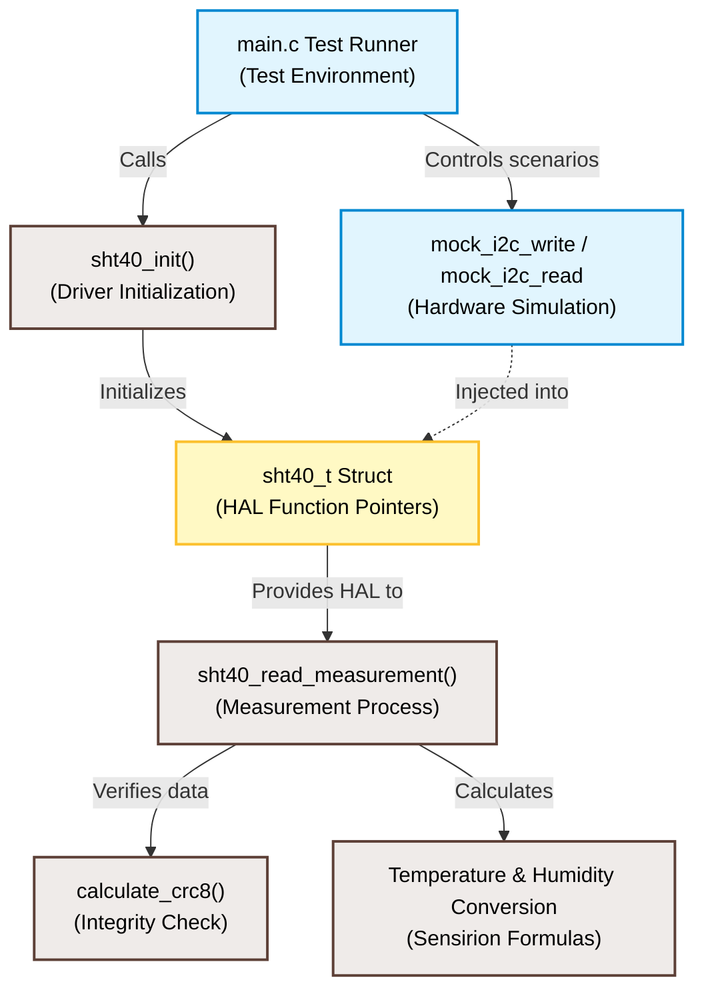

# 🌡️ sht40-embedded-driver

A portable C driver for the Sensirion SHT40 relative humidity and temperature sensor.

## 🛠️ Project Status: Feature Complete & Tested

The core driver implementation and the software verification environment are complete. The driver has been successfully validated against communication errors and checksum corruption using a local hardware mock interface.

## ✨ Features

- 🔌 Hardware-independent architecture using function pointers (HAL approach)
- 🎯 Support for SHT40 measurement precision modes
- ✅ CRC-8 checksum verification according to Sensirion datasheet
- ⚠️ Robust I2C communication error handling
- 🌡️ Precise temperature and relative humidity conversion
- 🧪 Automated software test suite (Mock environment) for PC-based validation

## 📁 Project Structure

```text
sht40-embedded-driver
├── src
│   ├── sht40.h       # Driver interface (HAL & API definitions)
│   └── sht40.c       # Driver implementation (CRC & math formulas)
├── tests
│   └── main.c        # Software mock test suite
└── README.md
```

## 🧩 Hardware Abstraction Layer (HAL)

The driver does not depend on a specific microcontroller architecture. Hardware-specific functions are injected dynamically via function pointers:

- sht40_i2c_write_fn: Custom I2C transmission
- sht40_i2c_read_fn: Custom I2C reception
- sht40_delay_ms_fn: Platform-specific millisecond timer

## 📊 Software Architecture



## 🧪 How to Run Software Tests

The project includes a standalone test suite in tests/main.c that simulates a virtual SHT40 sensor. It validates the mathematical conversion formulas and injects simulated bus errors and corrupted CRC checksums to verify driver stability.

To compile and run the tests on your local PC using any standard C compiler (e.g., GCC):

```bash
gcc src/sht40.c tests/main.c -o sht40_test
./sht40_test
```

### 📊 Expected Test Output

The test execution will run through three distinct test modes:
1. Successful Measurement: Validates 25.00 degC and 50.00 percentRH outputs using predefined data-register ticks.
2. Simulated I2C Bus Failure: Confirms that the driver gracefully handles communication aborts.
3. Simulated Corrupted CRC: Confirms that the driver detects and drops manipulated hardware bytes.
